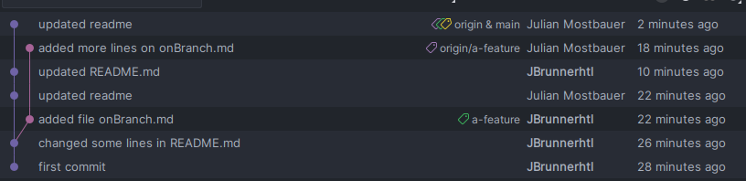

# Documentation

## Schritt 1
- Erstelle ein Repository auf GitHub.
- Dann lokal mit `git init` und verbinde es mit dem Repository auf GitHub mit dem Befehl `git remote add origin "repo"`.
- `touch onMain.md` zum erstellen der Datei.
- `git add onMain.md` um die Datei in die stagging area zu bringen.
- `git commit -m "message"` um einen commit mit einer Commit Message zu machen.
- `git push` um den neuen commit auf das remote Repository zu übertragen

## Schritt 2
- Erstelle mit `git branch a-feature` einen neuen Branch namens *a-feature*
- Dann mit `git checkout a-feature` auf den neuen Branch wechseln.
- Mit `git add .`, `git commit -m "initial commit"` und `git push --set-upstream origin a-feature` den neuen Branch initzalisieren.
- Dann mit `touch onBranch.md` eine neue file erzeugen.
- Diese dann wieder mit `git add onBranch.md`hinzufügen und mit `git commit -m "added file onBranch.md"` committen und mit `git push` pushen.  

## Schritt 3
- `git checkout a-feature` um auf den richtigen Branch zu sein
- onBranch.md bearbeiten
- `git add onBranch.md` und `git commit -m "message"` um die Veränderungen in einen commit zu geben
- `git log` um die history anzusehen

## Schritt 4, 5, 6

- Wie man hier sieht, ist der violette Strich der *main Branch* und der andere der *a-feature Branch*
- Hier sieht man schon die history, aber wenn Sie es noch etwas detaillierter möchten, nutzen Sie auf der Console den Kommand `git log`.
- Warum ist aber der Content nicht der gleiche? Ganz einfach, weil wenn man auf main committed bekommt es kein andere Branch mit. Das gleiche auch umgekehrt.

## Schritt 7, 8, 9
- Extra Zeilen im onMain.md hinzufügen
- `git add onMain.md` um die Veränderungen in die Stagging Area zu bringen
- `git commit -m "added lines"` um einen Commit mit den Veränderungen an zulegen.
- In der History kann man die 3 Commits am main branch sehen:
```
❯ git log --graph
* commit 553638c3d607d52fdcc32c837eb371b5326aaccf (HEAD -> main, origin/main, origin/HEAD)
| Author: Julian Mostbauer <julian.mostbauer@outlook.com>
| Date:   Wed Dec 3 17:51:16 2025 +0100
| 
|     added lines to onMain, third
| 
* commit f6037a159b154f28b26da1a6284bd8710ec75cd8
| Author: Julian Mostbauer <julian.mostbauer@outlook.com>
| Date:   Wed Dec 3 17:51:05 2025 +0100
| 
|     added lines to onMain, second
| 
* commit 81a03c85a8a6db1b5a9f2eb516b2e3f1c80ac97f
| Author: Julian Mostbauer <julian.mostbauer@outlook.com>
| Date:   Wed Dec 3 17:50:55 2025 +0100
| 
|     added lines to onMain, first
| 
* commit 5704a9249dee00c6eeec54a72e3f43d666d9cd76
| Author: JBrunnerhtl <j.brunner1@students.htl-leonding.ac.at>
| Date:   Wed Dec 3 17:49:15 2025 +0100
| 
```

## Schritt 10, 11, 12
